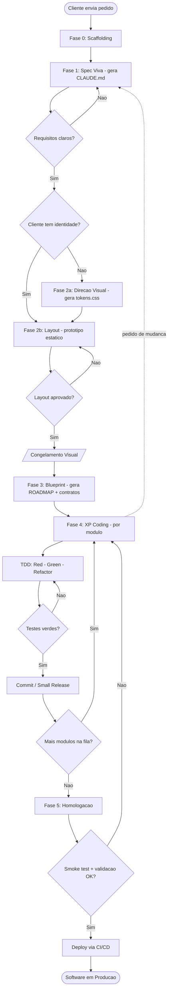

# Processo de Desenvolvimento Onda-Dev
### Documento de processo para modelagem BPMN e apresentação interna

> **Propósito deste documento.** Formalizar o ciclo de vida de desenvolvimento da Onda como um processo padronizado, repetível e previsível — a nossa "caixa preta". Entra um pedido de cliente; sai software em produção, com prazo blindado e qualidade verificada, independente do tipo de projeto (e-commerce, app, LP, sistema, automação).
>
> Está organizado para conversão direta em BPMN: os **atores** viram raias, os **artefatos** viram objetos de dados, e todos os **pontos de decisão e retornos** estão explícitos.

---

## 1. A caixa preta (visão executiva)

| Entrada | Processo | Saída |
|---|---|---|
| Pedido do cliente (pode ser uma única frase) | 5 fases sequenciais com fluxo Kanban e TDD | Software rodando em produção |

A promessa da caixa preta: dada qualquer entrada válida, o processo entrega um resultado previsível em **prazo calculado** (não estimado no chute) e com **qualidade verificada** em cada etapa (não prometida). O cliente não precisa entender o interior; precisa confiar que a saída é consistente.

---

## 2. Atores (raias do BPMN)

| Ator | Papel no processo |
|---|---|
| **Cliente** | Origem do pedido, fornece requisitos, aprova o visual, valida a entrega. Participante externo. |
| **Dev / Humano (Onda)** | Conduz o processo, faz as perguntas certas, toma decisões de arquitetura, valida saídas da IA, fala com o cliente. |
| **IA / Agentes (Claude Code)** | Gera artefatos (specs, layout, código, testes), executa TDD, roda revisões. Sempre sob supervisão do humano. |

> Sugestão de raias: pool externo **Cliente** (com fluxo de mensagens) + pool **Onda** com duas raias internas, **Humano** e **IA**.

---

## 3. Artefatos (objetos de dados do BPMN)

Os documentos que fluem entre as atividades. São os entregáveis palpáveis de cada fase:

| Artefato | Nasce na | Função |
|---|---|---|
| `CLAUDE.md` | Fase 1 | Fonte única da verdade: épicos, histórias, stack, arquitetura |
| `tokens.css` / `DESIGN.md` | Fase 2 | Identidade visual **do projeto** (do cliente, nunca a da Onda) |
| Protótipo estático | Fase 2 | Interface aprovável, com dados fictícios |
| `ROADMAP.md` + contratos de API | Fase 3 | Planta técnica: módulos, pesos, contratos Request/Response |
| Commits / Small Releases | Fase 4 | Código testado e pronto para produção |
| Deploy | Fase 5 | Software em produção |

---

## 4. Eventos de início e fim

- **Evento de início:** Cliente envia o pedido.
- **Evento de fim:** Software em produção, validado e entregue.

---

## 5. O processo, fase a fase

Cada fase descrita com: **entrada → atividades → decisão → saída → ator**.

### Fase 0 — Scaffolding
- **Entrada:** pedido aceito, projeto iniciado.
- **Atividades:** clonar o template `onda-starter`; ativar a skill de perfil conforme o tipo (e-commerce, app, LP, sistema...).
- **Saída:** repositório preparado, contexto enxuto.
- **Ator:** Humano + IA.

### Fase 1 — Spec Viva (gera o `CLAUDE.md`)
Transforma o pedido (muitas vezes vago) na especificação viva do projeto.
- **Entrada:** pedido do cliente.
- **Atividades:**
  1. Briefing: perguntas que destravam o escopo (público, dores, regras, volume).
  2. Mapeamento de épicos (grandes blocos do sistema).
  3. Quebra em histórias de usuário ("Como [X], quero [Y] para [Z]").
  4. Definição de critérios de aceite (regras rigorosas de sucesso).
  5. Geração do `CLAUDE.md`.
- **Decisão (gateway):** *Requisitos claros o suficiente?* Não → volta ao briefing. Sim → avança.
- **Saída:** `CLAUDE.md`.
- **Ator:** Humano conduz; Cliente fornece; IA redige.

### Fase 2 — Layout & Congelamento Visual
Mitiga o risco de o cliente mudar o fluxo depois e destruir o banco de dados. **É condicional**, conforme o cliente tenha ou não identidade.
- **Entrada:** `CLAUDE.md`.
- **Decisão (gateway):** *O cliente tem identidade visual?*
  - **Não → Fase 2a (Direção Visual):** briefing de marca curto → a IA gera 2-3 direções divergentes em *style tiles* → cliente escolhe uma → refino → emissão do `tokens.css` + `DESIGN.md`. Parte-se de um *starter neutro e acessível*, nunca da marca da Onda.
  - **Sim → vai direto para a Fase 2b.**
- **Fase 2b (Layout):** a IA lê o `CLAUDE.md` + a identidade do projeto e gera o front 100% estático com dados fictícios (hierarquia, responsividade, acessibilidade AA, estados de erro/carregamento).
- **Decisão (gateway):** *Cliente aprova o layout?* Não → revisa. Sim → **Congelamento Visual** (a partir daqui, mudar o visual é mudança de escopo).
- **Saída:** protótipo aprovado e congelado; `tokens.css` definido.
- **Ator:** IA gera; Cliente aprova; Humano media.
- **Nota de prazo:** se houve criação de identidade (2a), o termo da Fase 2 cresce (~2 → ~4 dias) e isso é precificado como item próprio.

### Fase 3 — Blueprint (gera o `ROADMAP.md`)
A planta técnica, desenhada antes de codificar.
- **Entrada:** visual congelado.
- **Atividades:**
  1. Modelagem do banco (tabelas e relacionamentos definidos com exatidão).
  2. Geração do `ROADMAP.md`, dividindo o sistema em **módulos independentes**.
  3. Pesagem de cada módulo (Complexidade + Risco): Pequeno (1-2d), Médio (3-4d), Grande (5-7d).
  4. Definição dos **contratos de API** (Request/Response) — antes de qualquer código.
  5. Rastreabilidade história ↔ módulo (relação N:1, não 1:1).
- **Saída:** `ROADMAP.md` + contratos + **prazo técnico calculado**.
- **Ator:** Humano decide arquitetura; IA gera o roteiro.

### Fase 4 — Esteira XP (codificação por módulo)
Execução em fluxo contínuo (Kanban), consumindo o `ROADMAP.md`.
- **Entrada:** `ROADMAP.md`.
- **Atividade de abertura:** Diretiva Primária ("Leia o `CLAUDE.md` e o `ROADMAP.md`; não altere a sintaxe do código existente").
- **Ciclo por módulo (TDD):**
  1. **Red:** IA escreve testes com mocks; eles falham.
  2. **Green:** IA escreve só o código necessário para passar.
  3. **Refactor:** aplica DRY e otimiza sem quebrar os testes.
  4. Revisão de segurança (agente `revisor-seguranca`) nos módulos de risco.
  5. Commit limpo (Small Release).
- **Decisões (gateways):**
  - *Testes verdes?* Não → volta ao ciclo TDD.
  - *Há pedido de mudança do cliente?* Sim → **retorno à Fase 1** (atualiza `CLAUDE.md`, atualiza testes, só então codifica).
  - *Ainda há módulos na fila?* Sim → puxa o próximo. Não → avança.
- **Saída:** todos os módulos testados e commitados.
- **Ator:** IA codifica; Humano supervisiona e valida.

### Fase 5 — Homologação, Deploy e Encerramento
- **Entrada:** módulos completos.
- **Atividades:**
  1. **Smoke test local:** subir o ambiente via Docker; rodar toda a esteira de testes.
  2. **Validação humana** ponta a ponta.
  3. Revisão final de segurança.
- **Decisão (gateway):** *Smoke test + validação humana OK?* Não → **retorno à Fase 4**. Sim → avança.
- **Saída:** **Deploy via CI/CD** → software em produção.
- **Ator:** Humano valida; IA executa; Cliente recebe a entrega.

---

## 6. Gateways e retornos (o mapa de decisões — núcleo do BPMN)

| # | Onde | Pergunta | Caminho "Sim" | Caminho "Não" |
|---|---|---|---|---|
| G1 | Fim da Fase 1 | Requisitos claros? | Vai para Fase 2 | Volta ao briefing (Fase 1) |
| G2 | Início da Fase 2 | Cliente tem identidade? | Vai para Fase 2b | Entra na Fase 2a (cria identidade) |
| G3 | Fim da Fase 2 | Layout aprovado? | Congelamento → Fase 3 | Revisa o layout (Fase 2b) |
| G4 | Dentro da Fase 4 | Testes verdes? | Commit | Volta ao ciclo TDD |
| G5 | Dentro da Fase 4 | Pedido de mudança? | **Retorna à Fase 1** | Continua |
| G6 | Dentro da Fase 4 | Mais módulos na fila? | Puxa próximo módulo | Vai para Fase 5 |
| G7 | Dentro da Fase 5 | Smoke test + validação OK? | Deploy | **Retorna à Fase 4** |

**Retornos (loops) que o BPMN precisa representar:**
- Mudança de funcionalidade na Fase 4 → volta à Fase 1 (não se codifica na hora).
- Mudança no visual já congelado → mudança de escopo → aditivo de prazo (volta à Fase 2).
- Falha em teste ou homologação → volta ao ciclo correspondente.

---

## 7. Rascunho do fluxo (ponto de partida para o BPMN)



> Este é um fluxograma simples (Mermaid). No BPMN você o enriquece com raias (Cliente / Humano / IA), objetos de dados (os artefatos da seção 3) e a tipagem correta dos gateways (exclusivos XOR).

---

## 8. Mapa para BPMN (cheatsheet de conversão)

| Elemento BPMN | No processo Onda-Dev |
|---|---|
| Evento de início | Cliente envia pedido |
| Evento de fim | Software em produção |
| Tarefas / atividades | As atividades listadas em cada fase (seção 5) |
| Subprocessos | Cada uma das 5 fases (+ Fase 0) |
| Gateways exclusivos (XOR) | G1 a G7 (seção 6) |
| Loops / fluxos de retorno | Retornos da seção 6 |
| Raias (lanes) | Cliente · Humano · IA (seção 2) |
| Objetos de dados | CLAUDE.md, tokens.css, ROADMAP.md, commits, deploy (seção 3) |

---

## 9. Previsibilidade: como a caixa preta calcula o prazo

A métrica é o **peso dos módulos** do `ROADMAP.md`, não horas.

```
Prazo = Tempo da Fase 2 + Soma(dias dos módulos das Fases 3 e 4) + 2 dias (Fase 5)
```

- Fase 2 = ~2 dias (cliente traz identidade) ou ~4 dias (identidade criada do zero).
- Módulos: Pequeno 1-2d · Médio 3-4d · Grande 5-7d.

O mesmo método precifica **aditivos**: uma funcionalidade nova pedida no meio é medida com o mesmo peso e soma ao prazo de forma consistente.

---

## 10. Definição de pronto (o filtro de qualidade)

Nenhuma entrega fecha sem responder sim às três camadas da marca:

- **Belo** — bate com a identidade do projeto aprovada na Fase 2.
- **Fluido** — funciona sem atrito; estados de erro e carregamento tratados.
- **Seguro** — TDD verde, dados protegidos, revisão de segurança aprovada.

Faltou uma camada, não está pronto. Esse é o controle de qualidade que torna a saída da caixa preta confiável.

---

*Onda · Documento de processo · base para modelagem BPMN. Documento vivo — versionar a cada evolução do método.*
